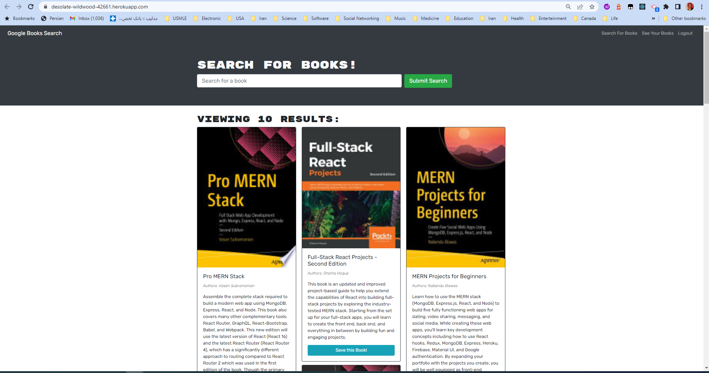

# Book-Search-Engine-GraphQL-API

## Book-Search-Engine-GraphQL-API 
Google Books API search engine built with a RESTful API, and refactor it to be a GraphQL API built with Apollo Server. The app was built using the MERN stack, with a React front end, MongoDB database, and Node.js/Express.js server and API. It's already set up to allow users to save book searches to the back end.

## Contributions

Made by John Aslani

## License: MIT

This program licensed under [MIT](https://img.shields.io/badge/license-MIT-blue)

## Screenshot

## Link to deployed application

https://desolate-wildwood-42661.herokuapp.com/

## Questions

For further information see [my GitHub](https://github.com/johnaslani) or [Weather-Dashboard](https://github.com/johnaslani/Book-Search-Engine-GraphQL-API)

Should you have any questions, please reach me at [aslani.john@gmail.com](mailto:aslani.john@gmail.com)